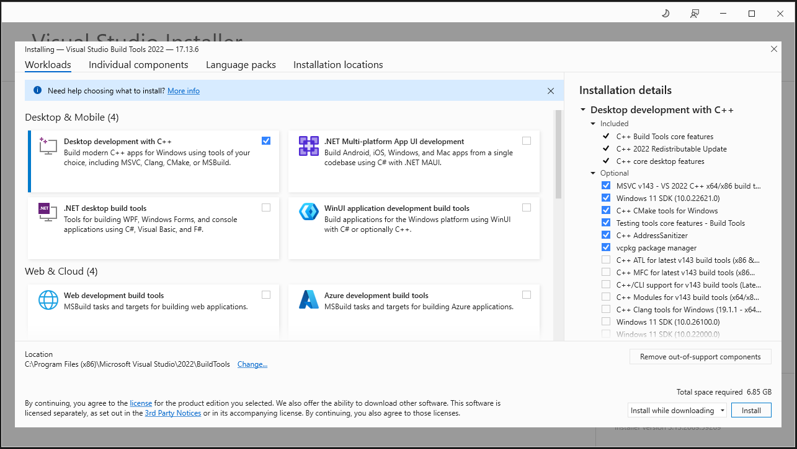

# CUH respiratory viruses modelling

**Author**: Yin-Chi Chan [\<yinchi.chan@nhs.net\>](mailto:yinchi.chan@nhs.net), Institute for Manufacturing, University of Cambridge

To run:

1. Download this code
2. Install uv: <https://docs.astral.sh/uv/getting-started/installation/#standalone-installer>
3. `cd /path/to/project`
4. `uv sync`

Some dependencies may need to be compiled, in which case the above step may fail. To resolve this:

- On Windows, use [Visual Studio Build Tools](https://visualstudio.microsoft.com/downloads/#build-tools-for-visual-studio-2022).
- On Linux (Debian or Ubuntu), use `apt install build-essential`.

Then, run Step 4 again.

5. `uv run python -m cuh_resp_model`
