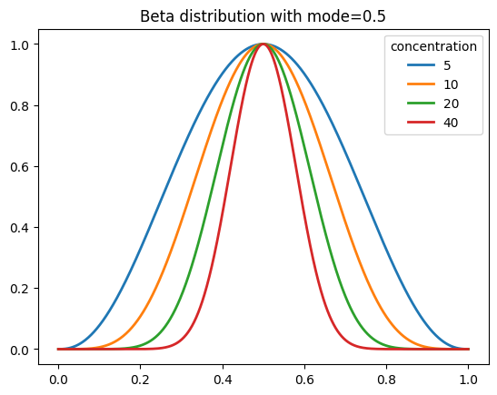
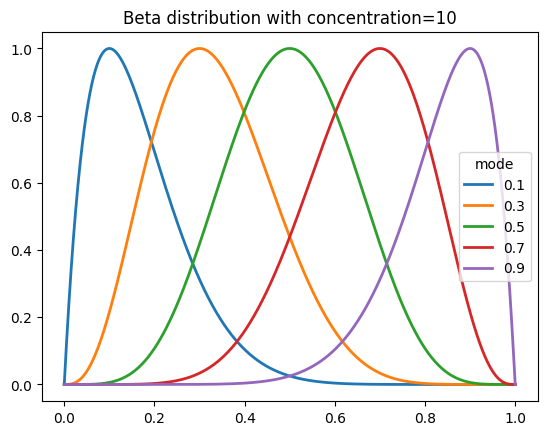

# 1 Upload files

Dropdown for illness: COVD-19, Influenza, RSV, Other

- Done

Provide more details on which columns are sufficient and/or allowable e.g. ones relating to critical care admissions

- Added hover cards for information
- TODO: add appropiate text to hover cards

Do column headers need to match exactly?

- Yes.

Are "extra" columns tolerated?

- Yes.

Would be good to allow other file types e.g. CSV txt files

Would be preferable to be able to move through this section without uploading files, then enter all parameters manually as an alternative

 

# 2 Arrival Modelling

Reformat dates as dd-mm-yyyy

- Done

Calendar moves up and down when scrolling through months, making it slightly awkward to use

- This seems to be a limitation of the calendar having to fit onto the screen without scrolling. The default behavior appears to be to show the calendar below the input box if space allows, but above otherwise.

Would be helpful to be able to manually enter dates

- Changed to different input widget that supports this.  However, need to manually clear the existing value using backspace or select all + delete.
- **TODO**: validate inputs

With the white background, some of the items from the mouse-over icons disappear after hovering over them

- Changed to another figure theme for light mode that doesn't appear to have this bug.

Double-clicking on plot doesn't seem to be reliable (although the Autoscale and Reset Axes buttons are)... also true of other plots

- Not sure how to fix this, as this is a 3rd-party library...

Not sure of difference between Autoscale and Reset Axes functions

- I think this difference only takes effect when the plot has manual axis bounds set, in which case autoscale shows all the data and "reset axes" uses the original bounds.

Is Poisson distribution the best/only option - haven't we used different distributions in the past?

The generated curves never seem to be appreciably skewed, even when selecting a period of historical admissions which is... is there a skew parameter?

- The beta distribution seems to be a good option for this.  We can set the skew by specifying the mode (maximum) of the curve, which is easy to understand.

Can the distribution be overlaid on the data used to generate it

Can the age distribution of admissions be displayed and manually adjusted?

Combined with the next section, this would allow users to test interventions in silico... broaden use case...

Is it possible to "save" parameters e.g. for a given illness, which could then be uploaded and adjusted?

 

# 3 LoS Modelling

Difficult to know which parameter to give precedence to when deciding best distribution?

Are mean and STDEV the best summaries for non-parametric distributions... maybe median and IQR would be better and/or more understandable for non-scientists?

Would be preferable to be able to enter parameters manually as an alternative, similar to 2_Arrival modelling

Would be preferable to be able to define age ranges - or just group all patients together

Indicate lengths of pauses in notes e.g. may be several seconds, or may be up to 1 minute, etc.

What about critical care length of stay, likelihood of arriving on critical care, etc.?

Needs to be robust to moving forward and back in the web app

 

# 4 Simulate

Allow download of results as Excel or tab-delimited file

When clicking "About", can't then get back to prior simulation results

When attempting to move Back to 3_LoS Modelling, there is a long delay... re-calculating, rather than just going back?

How to "splice together" with actual data - to ensure the left hand side of the modelled distribution (up-slope) matches the actual numbers

 

# Typos/textual changes

Clearer titles for files to upload in 1 (currently very succinct/similar!)

Likewise for 2

Hover-over info buttons e.g. required headings, etc.

"COVID-19" (rather than COVID)

"Upload Files" (capital letter)

"Length of Stay Modelling" (expand acronym)

Generate patient arrival scenarios (pleural)

Is it web app or webapp?

Change headings for simulation results e.g. "Paediatrics [defined age range]"

Various others pointed out by Tom and Denise as we went along!